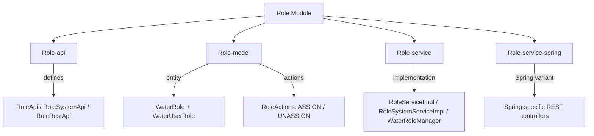
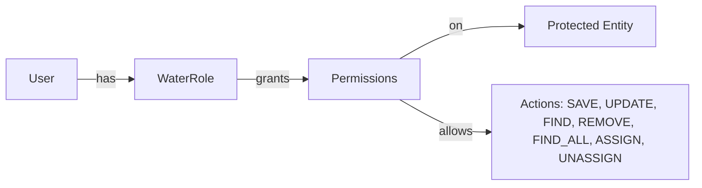

# Role Module

The **Role** module provides the role management system for the Water Framework. Roles are fundamental to the authorization model — they group permissions and are assigned to users to control access to protected entities and actions.

## Architecture Overview



## Sub-modules

| Sub-module | Description |
|---|---|
| **Role-api** | Defines `RoleApi`, `RoleSystemApi`, `RoleRestApi`, `RoleRepository`, and `UserRoleRepository` interfaces |
| **Role-model** | Contains `WaterRole` and `WaterUserRole` JPA entities, plus `RoleActions` (ASSIGN/UNASSIGN) |
| **Role-service** | Service implementations, REST controller, `WaterRoleManager`, and `RoleIntegrationLocalClient` |
| **Role-service-spring** | Spring MVC REST controllers (`RoleSpringRestApi`, `RoleSpringRestControllerImpl`) and Spring Boot application |

## WaterRole Entity

```java
@Entity
@Table(name = "water_role")
@AccessControl(availableActions = { CrudActions.class, RoleActions.class },
    rolesPermissions = {
        @DefaultRoleAccess(roleName = "roleManager", actions = { "save","update","find","find_all","remove","assign","unassign" }),
        @DefaultRoleAccess(roleName = "roleViewer", actions = { "find", "find_all" }),
        @DefaultRoleAccess(roleName = "roleEditor", actions = { "save","update","find","find_all","assign","unassign" })
    })
public class WaterRole extends AbstractJpaEntity implements ProtectedEntity {
    private String name;        // Unique role name
    private String description; // Role description
}
```

### Entity Fields

| Field | Type | Constraints | Description |
|---|---|---|---|
| `id` | Long | Auto-generated | Primary key |
| `name` | String | `@NotNull`, `@NoMalitiusCode`, unique | Role identifier name |
| `description` | String | `@NoMalitiusCode` | Human-readable description |

## WaterUserRole Entity

`WaterUserRole` is a join entity that tracks user-to-role associations:

```java
@Entity
@Table(uniqueConstraints = @UniqueConstraint(columnNames = {"role_id", "userId"}))
public class WaterUserRole extends AbstractJpaEntity {
    @ManyToOne
    private WaterRole role;     // The assigned role
    private long userId;        // The user who has this role
}
```

## RoleActions

In addition to standard `CrudActions`, the module defines custom actions for role assignment:

| Action | Description |
|---|---|
| `RoleActions.ASSIGN` | Permission to assign a role to a user |
| `RoleActions.UNASSIGN` | Permission to remove a role from a user |

## API Interfaces

### RoleApi (Public — with permission checks)
Extends `BaseEntityApi<WaterRole>` — provides standard CRUD operations with permission enforcement, plus:

| Method | Permission Required | Description |
|---|---|---|
| `addUserRole(long userId, Role role)` | `RoleActions.ASSIGN` | Assign a role to a user |
| `removeUserRole(long userId, Role role)` | `RoleActions.UNASSIGN` | Remove a role from a user |

### RoleSystemApi (System — no permission checks)
Extends `BaseEntitySystemApi<WaterRole>` — for internal service-to-service calls, plus:

| Method | Description |
|---|---|
| `findUserRoles(long userId)` | Fetch all roles assigned to a user |
| `addUserRole(long userId, Role role)` | Assign a role (no permission check) |
| `removeUserRole(long userId, Role role)` | Remove a role (no permission check) |

### RoleRestApi (REST — HTTP endpoints)

| HTTP Method | Path | Action |
|---|---|---|
| `POST` | `/water/roles` | Create role |
| `PUT` | `/water/roles` | Update role |
| `GET` | `/water/roles/{id}` | Find role by ID |
| `GET` | `/water/roles` | Find all roles (paginated) |
| `DELETE` | `/water/roles/{id}` | Remove role |
| `POST` | `/water/roles/assign?userId=X&roleId=Y` | Assign role to user |
| `POST` | `/water/roles/unassign?userId=X&roleId=Y` | Unassign role from user |

## Default Roles

The module defines three default roles via `@AccessControl`:

| Role | Permissions |
|---|---|
| **roleManager** | `save`, `update`, `find`, `find_all`, `remove`, `assign`, `unassign` |
| **roleViewer** | `find`, `find_all` |
| **roleEditor** | `save`, `update`, `find`, `find_all`, `assign`, `unassign` |

These roles are automatically created at startup if they don't exist, following the Water Framework's convention for default role provisioning.

## Permission Model



Roles bridge the gap between users and permissions. The `@AccessControl` annotation on entities defines:
1. Which **actions** are available (e.g., `CrudActions`)
2. Which **default roles** are created with what **action mappings**

## Usage Example

```java
// Inject the role API
@Inject
private RoleApi roleApi;

// Create a new role
WaterRole role = new WaterRole();
role.setName("deviceManager");
role.setDescription("Manages IoT devices");
WaterRole saved = roleApi.save(role);

// Find all roles
PaginableResult<WaterRole> roles = roleApi.findAll(null, 10, 1);

// Using SystemApi (no permission checks)
@Inject
private RoleSystemApi roleSystemApi;

WaterRole found = roleSystemApi.find(saved.getId());

// Assign a role to a user
roleApi.addUserRole(userId, saved);

// Remove a role from a user
roleApi.removeUserRole(userId, saved);

// Find all roles for a user (via SystemApi)
Collection<Role> userRoles = roleSystemApi.findUserRoles(userId);
```

## RoleManager

The `WaterRoleManager` component implements the core `RoleManager` interface, providing high-level role management used internally by the framework:

```java
@Inject
private RoleManager roleManager;

// Create role if it doesn't exist
roleManager.createIfNotExists("customRole");

// Check if a user has a role
boolean hasRole = roleManager.hasRole(userId, "roleManager");

// Get all roles for a user
Set<Role> roles = roleManager.getUserRoles(userId);
```

## Multitenancy (Company-based)

Roles are tenant-aware.

- `WaterRole extends AbstractJpaTenantEntity` → carries a nullable `companyId`: **null = global role** (visible in every tenant), a value = a role scoped to that company.
- Note (deferred): per-tenant role ASSIGNMENT (`WaterUserRole` `companyId` dimension) and company-aware role resolution in the JWT are NOT yet implemented.

Deferred: company-aware role assignment/resolution and granular per-entity opt-out (see the `multitenancy-knowledge` skill).

## Testing

The module includes Karate feature tests for full CRUD validation:

```gherkin
Feature: Role REST API

  Scenario: CRUD operations on roles
    # Create
    Given url baseUrl + '/water/roles'
    And request { "name": "testRole", "description": "A test role" }
    When method POST
    Then status 200

    # Find
    Given url baseUrl + '/water/roles/' + response.id
    When method GET
    Then status 200
    And match response.name == 'testRole'

    # Update
    Given url baseUrl + '/water/roles'
    And request { "id": "#(id)", "name": "testRoleUpdated", "description": "Updated" }
    When method PUT
    Then status 200

    # Delete
    Given url baseUrl + '/water/roles/' + id
    When method DELETE
    Then status 200
```

## Dependencies

- **Core-api** — Base interfaces (`BaseEntityApi`, `BaseEntitySystemApi`)
- **Core-model** — `AbstractJpaEntity`, `ProtectedEntity`
- **Core-security** — `@AccessControl`, `@DefaultRoleAccess`, `CrudActions`
- **Permission** — Permission system for role-action mapping
- **Rest** — REST controller infrastructure
